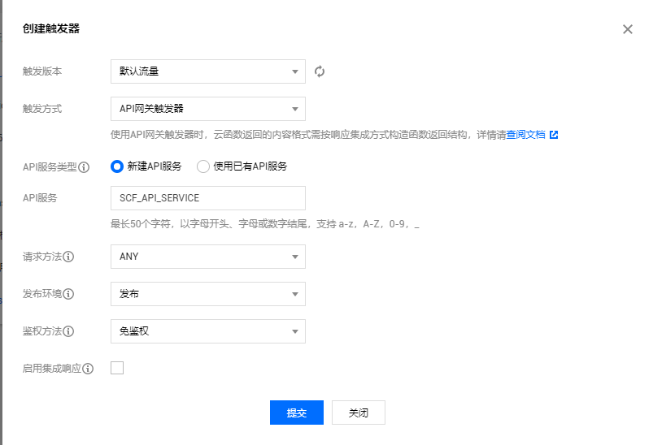

<h1 align="center">Serverless 实践</h1>

**Referenece Address**: [@云函数 SCF 组件][1]

---

- [Function Service:自动创建云函数](#function-service自动创建云函数)
- [Function Service:手动创建云函数](#function-service手动创建云函数)
  - [Serverless Framework](#serverless-framework)
  - [Serverless Components](#serverless-components)
  - [API 网关组件](#api-网关组件)
    - [创建](#创建)
- [静态网站部署](#静态网站部署)
- [Express 项目部署](#express-项目部署)
  - [层](#层)

---

## Function Service:自动创建云函数

- 进入[@腾讯云][2]，新建`函数服务` - 基本信息配置
  

- 函数配置
- 触发配置
  
- 查看云函数

## Function Service:手动创建云函数

### Serverless Framework

```powershell
	npm i serverless -g
	npm update serverless
	sls -v
	serverless -v
```

### Serverless Components

- 根据 [参考地址][1] 创建目录
- 编写 yaml 文件，进行配置
- 编写.env，（访问管理-访问密钥-API 密钥管理）
- 执行命令 `sls --debug`，将 yaml 的配置发布到云上（如果没有配.env，会需要进行扫码登录，登录后自动生成.env）
- 在 `函数服务` 中可以查看部署的云函数

### API 网关组件

- 所有 API 的调用统一接入的 API 网关层
- 是用户和服务器的连接器

#### 创建

- 在`API网关-服务`创建网关
- 在本地进行创建

  1. 新建目录`tencent-api`
  2. 配置 yaml 文件
  3. `sls --debug`部署
  4. 在`API网关-服务`查看新建的网关服务

> 在新建云函数时，可以新建 API 服务也可以使用已有的 API 服务

## 静态网站部署

> [应用][3]：查看所有的应用
> [官方配置][5]

1. 配置 yaml 文件
2. `sls --debug`部署

## Express 项目部署

[官方配置][4]

1. 配置 yaml 文件
2. 配置 `sls.js`
3. `serverless --debug`部署

### 层

由于项目依赖很大，所以使用`层`进行管理 [官方配置][6]

- 新建层：上传 node_modules.zip 包
- 部署代码
- 在`云函数-函数服务-函数管理-层管理`绑定层

> 会生成对应的`云函数`

[1]: https://cloud.tencent.com/document/product/1154/39271#2.-.E5.88.9B.E5.BB.BA
[2]: https://console.cloud.tencent.com/scf/list?rid=1&ns=default
[3]: https://serverless.cloud.tencent.com/
[4]: https://github.com/serverless-components/tencent-express/blob/v2/docs/configure.md
[5]: https://github.com/serverless-components/website
[6]: https://github.com/serverless-components/tencent-layer
